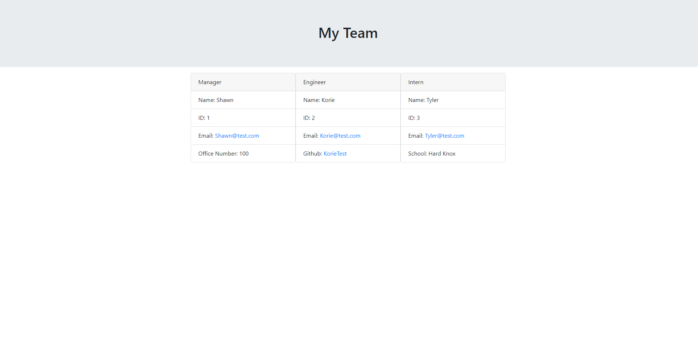

# Team Profile Generator

## Desription

This project allows a user to build a team and have a team profile generated on an HTML web page.
This project was designed to help businesses create a simple team roster easily.
This project was built to demonstrate an ability to use object oriented programming.

During this project I learned a lot about how classes interact and using functions from classes.

## Table of Contents

- [Installation](#installation)
- [Usage](#usage)
- [Credits](#credits)
- [Tests](#tests)
- [Questions](#questions)
- [License](#license)

## Installation

## Usage

Install the package using "npm install" then run "npm start" and follow the prompts. Click finish team when you are done and then select the HTML file in the html folder to have your webpage.
Please see usage tutorial at https://youtu.be/FCacnj_oaQM.

## Credits

## Tests

Run "npm test" after installing jest

## Questions

Please contact me with any questions at Ralakash
or email me at ShawnKaralash@gmail.com

## License

This project is licensed under MIT license
